# RFdiffusion Installation Guide

RFdiffusion은 David Baker Lab에서 개발된 단백질 백본을 디자인하기위한 알고리즘으로써 GPU를 활용하기 때문에 Cuda , Python, Pytorch 를 필요로합니다.

여기서는 다음과 같은 CUDA, Pytorch 버전을 만족하는 RFdiffusion을 설치하여 사용합니다.
> CUDA version: **12.1**  
> Pytorch version: **Stable 2.5.1**

## Anaconda 설치
### 1. 아래 링크를 통해 아나콘다 다운로드 페이지로 이동

> 링크 : **https://www.anaconda.com/download/success**

### 2. Linux에서 64-Bit (X86) Installer 의 링크 복사
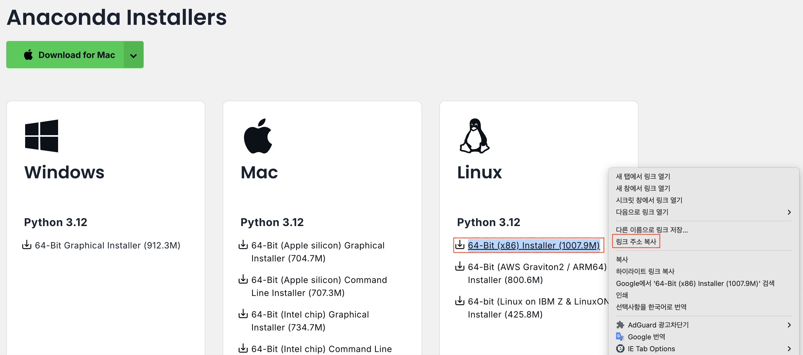

### 3. 아래 코드를 이용하여 2번에서 복사한 다운로드 링크를 이용하여 아나콘다 설치파일을 다운로드

> CODE: **`wget https://repo.anaconda.com/archive/Anaconda3-2024.06-1-Linux-x86_64.sh`**

위 코드는 예시이며, **`https://repo.anaconda.com/archive/Anaconda3-2024.06-1-Linux-x86_64.sh`** 부분에 2번에서 복사한 다운로드 링크를 붙여넣기로 입력합니다.

### 4. 아래 코드를 이용해서 3번에서 다운받은 아나콘다 설치 파일을 실행하여 아나콘다 설치
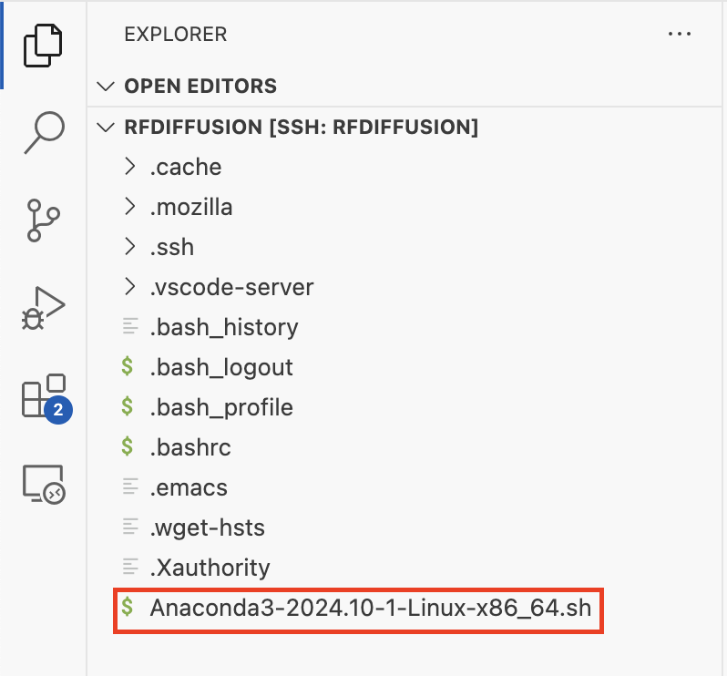

> CODE: **`sh Anaconda3-2024.06-1-Linux-x86_64.sh`**

위 코드는 예시이며, **`Anaconda3-2024.06-1-Linux-x86_64.sh`** 에 3번을 통해 다운받은 설치파일(sh 파일)을 입력합니다.

설치가 완료되면 다음과 같이 `anaconda3` 이라는 폴더가 생성됩니다.

### 5. WSL 재실행 (이건 넣을지 말지 고민 중)

## RFdiffusion을 위한 가상환경 셋팅

### RFdiffusion Github 공식 링크: **https://github.com/RosettaCommons/RFdiffusion?tab=readme-ov-file**

### 1. RFdiffusion Github Repository(저장공간) 복제
> CODE : **`git clone https://github.com/RosettaCommons/RFdiffusion.git`**

위 코드를 통해 RFdiffusion의 Github Repository를 복제하면, 아래 그림과 같이 `RFdiffusion` 이라는 폴더가 생성됩니다.

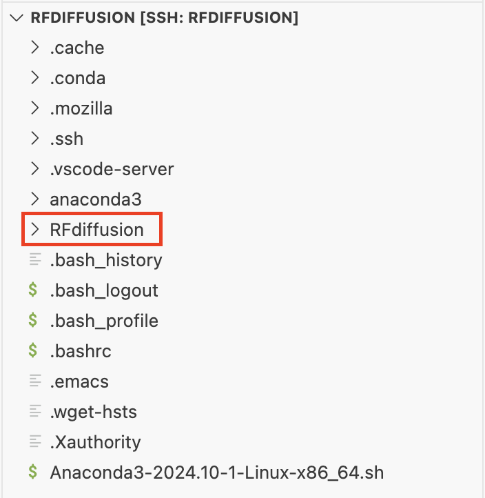

### 2. 복제한 `RFdiffusion` 폴더로 이동 및 RFdiffusion Model Weight(모델 가중치) 다운로드
> CODE: **cd RFdiffusion**

위 코드를 통해 아래 그림과 같이 앞서 복제한 `RFdiffusion` 폴더로 이동합니다.

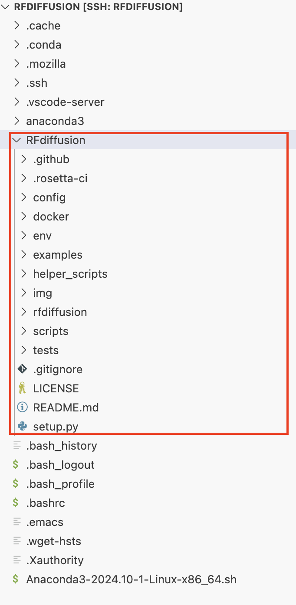

> CODE: **mkdir models && cd models**  

위 코드를 통해 아래 그림과 같이 `models` 라는 폴더를 생성하고, 현재 위치를 `models` 폴더로 이동합니다.

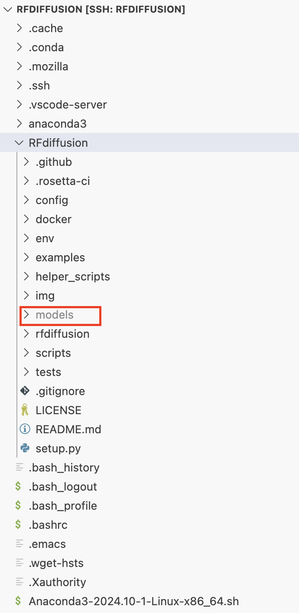

#### Model Weight(모델 가중치) Download
> CODE: **wget http://files.ipd.uw.edu/pub/RFdiffusion/6f5902ac237024bdd0c176cb93063dc4/Base_ckpt.pt**  
> CODE: **wget http://files.ipd.uw.edu/pub/RFdiffusion/e29311f6f1bf1af907f9ef9f44b8328b/Complex_base_ckpt.pt**  
> CODE: **wget http://files.ipd.uw.edu/pub/RFdiffusion/60f09a193fb5e5ccdc4980417708dbab/Complex_Fold_base_ckpt.pt**  
> CODE: **wget http://files.ipd.uw.edu/pub/RFdiffusion/74f51cfb8b440f50d70878e05361d8f0/InpaintSeq_ckpt.pt**  
> CODE: **wget http://files.ipd.uw.edu/pub/RFdiffusion/76d00716416567174cdb7ca96e208296/InpaintSeq_Fold_ckpt.pt**  
> CODE: **wget http://files.ipd.uw.edu/pub/RFdiffusion/5532d2e1f3a4738decd58b19d633b3c3/ActiveSite_ckpt.pt**  
> CODE: **wget http://files.ipd.uw.edu/pub/RFdiffusion/12fc204edeae5b57713c5ad7dcb97d39/Base_epoch8_ckpt.pt**  
> (Optional) CODE: **wget http://files.ipd.uw.edu/pub/RFdiffusion/f572d396fae9206628714fb2ce00f72e/Complex_beta_ckpt.pt**  

#### Original structure prediction weights
> CODE: **wget http://files.ipd.uw.edu/pub/RFdiffusion/1befcb9b28e2f778f53d47f18b7597fa/RF_structure_prediction_weights.pt**

위 코드를 통해 `models` 폴더 안에 RFdiffusion을 사용하기 위한 Model Wegith(모델 가중치)를 다운받습니다.

아래 그림과 같이 비어있던 `models` 폴더에 새로운 파일들이 생성(다운)되는 것을 확인할 수 있습니다.

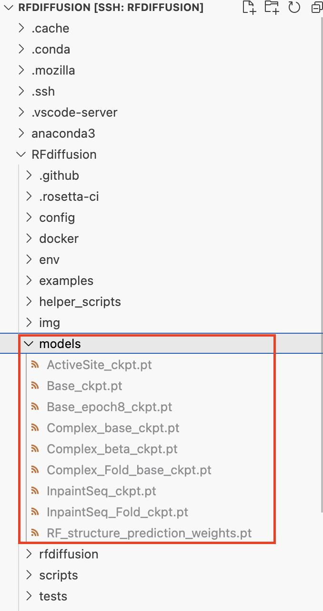

### 3. Conda 가상환경 생성

> CODE: **cd ..**  
> CODE: **conda env create -f env/SE3nv.yml** 

위 코드를 통해 `SE3nv` 라는 Conda 가상환경을 생성합니다.

> CODE: **conda env list**  

위 코드를 통해 아래 그림과 같이 `SE3nv`라는 가상환경이 목록에 추가되어 있는 것을 확인할 수 있음.

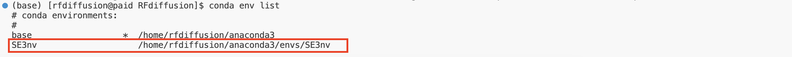

### 4. 생성한 Conda 가상환경 실행 및 RFdiffusion을 위한 사용 패키지 설치

> CODE: **conda activate SE3nv**  
> CODE: **cd env/SE3Transformer**  
> CODE: **pip install --no-cache-dir -r requirements.txt**  
> CODE: **python setup.py install**  

위 코드를 통해 앞서 설치한 `SE3nv` 라는 생성한 가상환경을 실행합니다.

아래 그림과 같이 코드 앞에 `(base)` 가 `(SE3nv)` 로 바뀌는 것을 통해 가상환경이 실행된 것을 확인할 수 있습니다.

### 5. Root 디렉토리로 이동 후 RFdiffusion Model 설치

> CODE: **cd ../..**  
> CODE: **pip install -e .**  

위 코드를 통해 Root Directory(루트 디렉토리)로 이동하며, RFdiffusion Model을 설치합니다.

### 6. RFdiffusion 예제 파일 압축 해제 

> CODE: **tar -xvf examples/ppi_scaffolds_subset.tar.gz -C examples/**  

위 코드를 통해 아래 그림의 `examples` 폴더의 `ppi_scaffolds_subset.tar` 라는 RFdiffusion 사용 관련 예제가 들어있는 폴더의 압축을 해제합니다.

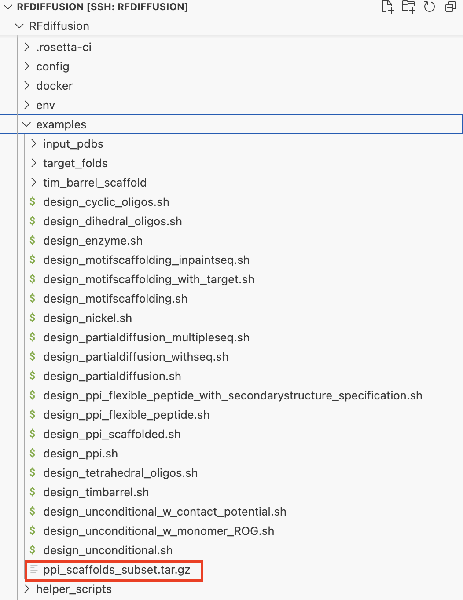

압축을 해제하면 아래 그림과 같이 `ppi_scaffolds` 폴더가 생성되며, 압축 해제한 파일들이 생성됩니다.

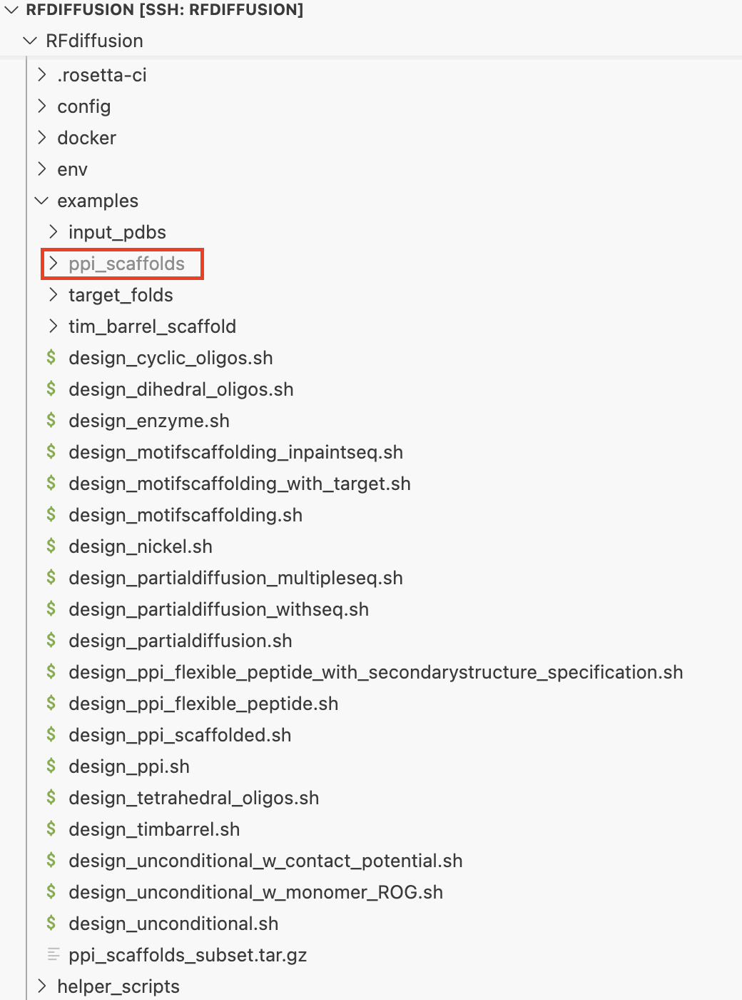

### 7. Pytorch 버전 확인

RFdiffusion은 기본적으로 `1.9.1 버전`의 Pytorch를 사용합니다.

현재 최신 Pytorch는 `Stable (2.5.0)` 버전(2024년 12월 12일 기준)이며, 기 설치된 1.9.1 버전의 Pytorch는 CUDA 10.2 / 11.3 버전과 호환됩니다.

현재 CUDA의 최신 버전은 12.6 버전(2024년 12월 12일 기준)으로 CUDA 10.2 / 11.3 버전은 매우 구버전입니다.

때문에 최신 Pytorch 최신 버전과 호환되는 CUDA 버전을 설치하고, 최신 Pytorch 버전을 재설치하여 사용합니다.

> CODE: **python**  
> CODE: **import torch**  
> CODE: **print(torch.__version__)**  

위 코드를 통해 아래 그림과 같이 현재 설치되어 있는 Pytorch의 버전을 확인할 수 있습니다.

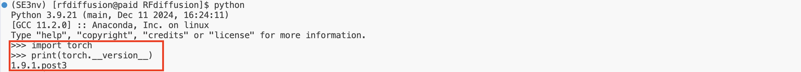

> CODE: **conda list |grep pytorch**  

그리고 위 코드는 또 다른 방법으로 Pytorch의 버전을 확인하는 코드입니다.  
위 코드를 통해 아래 그림과 같이 현재 설치되어 있는 Pytorch의 버전을 확인할 수 있습니다.

### 8. Pytorch 삭제

> CODE: **conda uninstall pytorch**  
> CODE: **conda list |grep pytorch**  

위 코드를 통해 설치되어 있는 Pytorhc 를 삭제하고, 정상적으로 삭제되었는지 확인합니다.

2번째 코드를 실행했을 때, 아래 그림과 같이 아무것도 출력되지 않는다면 정상적으로 삭제된 것입니다.

### 9. Pytorch 재설치

최신 버전의 Pytorch를 설치하기 위해 아래 링크로 이동하여 아래로 스크롤을 내립니다.

> 링크: **https://pytorch.org/**  

스크롤을 내리면 아래 그림과 같이 Pytorch를 설치하기 위한 조건을 선택하는 부분이 나타나는데, 알맞는 설치 조건을 선택하고 표시된 부분의 코드를 입력하여 Pytorch를 설치합니다.

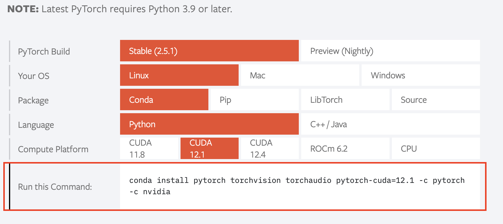

> CODE: **conda install pytorch torchvision torchaudio pytorch-cuda=12.1 -c pytorch -c nvidia**  

위 코드는 CUDA 12.1 버전과 호환되는 최신 Pytorch(Stable (2.5.1)) 설치 코드입니다.

### 10. Pythorch 설치 확인

> CODE: **conda list |grep pytorch**  

위 코드를 통해 Pytorch가 원하는 최신 버전으로 설치되었는지 확인합니다.

아래 그림과 같이 Pytorch가 검색되어 나타나며, 2.5.1 버전이 설치되어 있음을 확인할 수 있습니다.

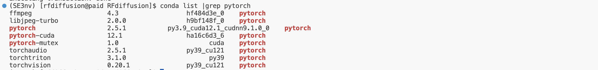

----------------------
## cuda toolkit 설치
1. 링크: https://developer.nvidia.com/downloads
   위 링크로 이동
2. CUDA Toolkit 클릭
3. Download Now 클릭
4. Archive of Previous CUDA Release 클릭
5. CUDA Toolkit 12.1.x 클릭
6. Operating System: Linux
   Architecture: x86_64
   Distribution: WSL_Ubuntu
   Version: 2.0
   Installer Type: deb(local)
   위와 같이 옵션 선택 후 아래 Installaion Instructions 따라 명령어 실행
   마지막 명령어: sudo apt-get -y install cuda-toolkit-12.1
   